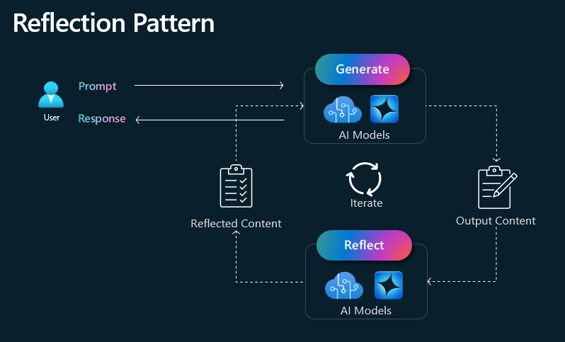
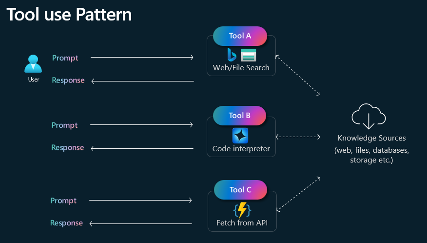
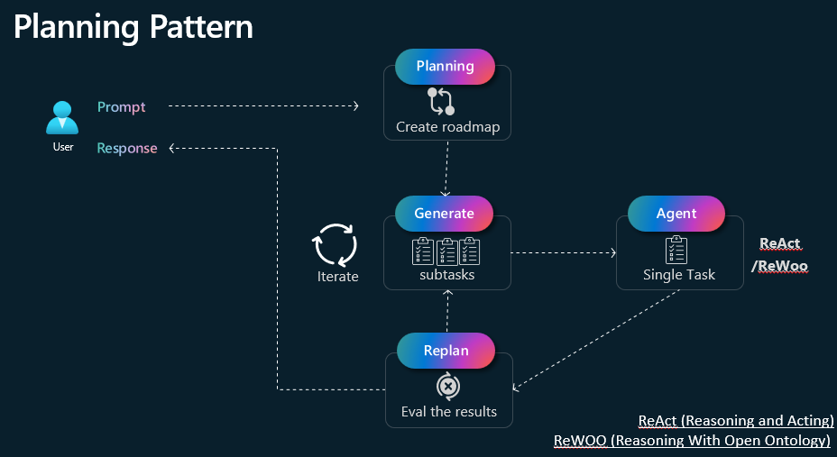
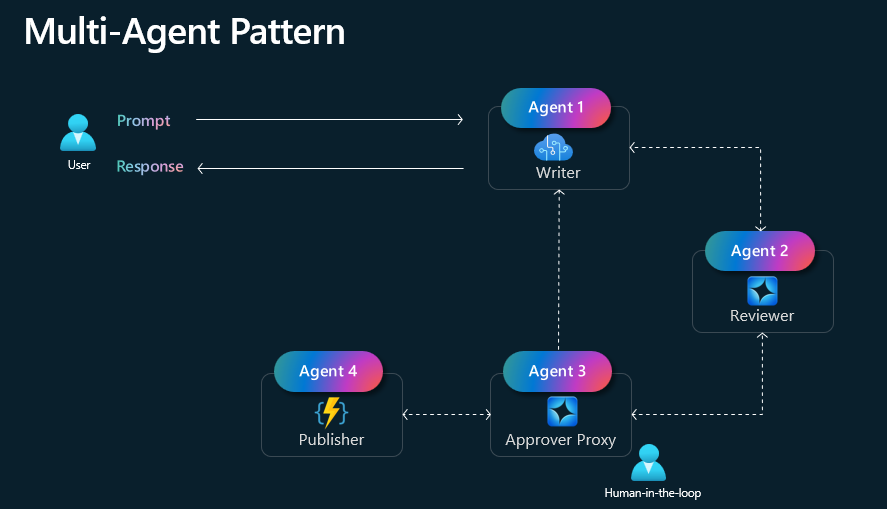

# Major Agentic Design Patterns

## Reflection
The Reflection pattern in Retrieval-Augmented Generation (RAG) refers to a method where the system iteratively refines its responses by incorporating feedback from previous outputs. Instead of generating an answer in a single pass, the model evaluates its own output, identifies potential errors or gaps, and retrieves additional relevant information to improve accuracy and coherence. This approach enhances the quality of responses by enabling self-correction and iterative learning, making it particularly useful for complex queries requiring deep reasoning or high factual accuracy.

## Tool Use
The Tool Use pattern enables an AI system to call upon external resources (e.g., databases, APIs, specialized models, or even software tools) to supplement its capabilities. By leveraging these external functionalities, the model can access updated information, perform specialized tasks like calculations or translations, and validate its own outputs. This approach extends the system’s scope and accuracy, especially for real-time data retrieval, advanced analytics, or domain-specific operations that exceed the model’s core knowledge base.

## Planning
The Planning pattern involves the AI system explicitly structuring a step-by-step strategy to address a query or solve a complex problem. By organizing tasks, determining dependencies, and outlining a logical flow of actions, the model can tackle multi-faceted or long-form reasoning tasks more effectively. This pattern often includes iterative refinement, where the system checks its reasoning at each stage, updates its plan as needed, and ensures that each step builds coherently toward a final, accurate answer. The Plan-and-Execute framework is a strategy for retrieval-augmented generation (RAG) that divides complex reasoning tasks into two distinct phases: planning and execution. While traditional ReAct agents think one step at a time, plan-and-execute emphasizes explicit, long-term planning.

## Multi-Agent
The Multi-Agent pattern is an advanced AI framework where multiple specialized agents collaborate to improve retrieval and generation processes. Instead of a single model handling all tasks, different agents are assigned specific roles, such as retrieval, planning, reasoning, verification, and generation. These agents communicate and refine outputs iteratively, leading to more accurate, context-aware, and explainable responses. Multi-Agent RAG is particularly useful for complex problem-solving, knowledge-intensive tasks, and long-context reasoning, enhancing the reliability and efficiency of AI-generated content.

**Reference**
- [ReAct paper](https://arxiv.org/abs/2210.03629)
- [Plan-and-Solve paper](https://arxiv.org/abs/2305.04091)
- [Multi-Agent Supervisor Concept](https://langchain-ai.github.io/langgraph/concepts/multi_agent/#supervisor)  
- [Multi-Agent Collabration Concept](https://langchain-ai.github.io/langgraph/concepts/multi_agent/#network) 