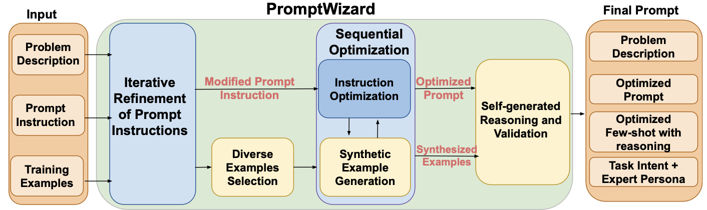
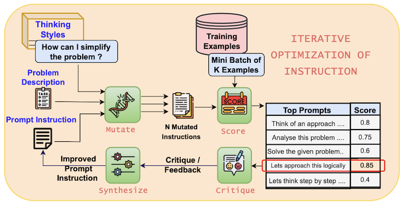
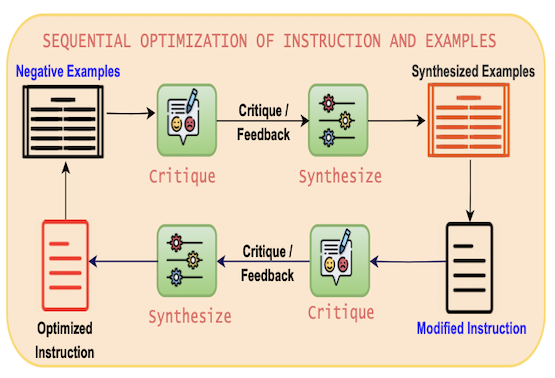

# Prompt Optimization using PromptWizard
---

## 1. Overview
PromptWizard, released as open source and paper by Microsoft, is a prompt optimization tool to maximize the performance of LLM. It is a prompt optimization framework that adopts a self-evolving mechanism in which LLM generates, critiques, refines, and continuously improves prompts and examples through feedback and synthesis.

- Paper: https://arxiv.org/abs/2405.18369
- Project: https://github.com/microsoft/PromptWizard

#### Iterative Refinement of Prompt Instructions
- **Mutate** the initial prompt command in various ways and create variations of the prompt using different styles.
- Perform prompt improvement through a **score, critique, and synthesize** cycle for each prompt variation.

#### Diverse Example Selection & Sequential Optimization
- Select **few-shot examples** from the training data.
- Critique and synthesize examples by classifying good examples (positive) and bad examples (negative).
- **Refine** this process repeatedly if necessary to include it in the optimized prompt.

#### Final prompt: Integration of Task Intent and Expert Persona
- **Optimized Few-shots with reasoning**: LLM ensures consistency by including a logical chain of reasoning (CoT) with specific examples of how to solve the problem
- **Task Intent**: Clear guidance on the direction or goal of problem solving
- **Expert Persona**: Provides an ideal role model (e.g., a math teacher) to solve the problem, thereby enhancing response consistency and expertise

## 2. How PromptWizard works
- Using the problem description and the initial prompt display, PromptWizard (PW) prompts the LLM to generate a variation of the task description to produce a variant Instruction. The best prompt is selected based on performance. PW has a built-in critique component that provides feedback to guide and tune prompt improvements over multiple iterations.
- Optimize in-context examples. To do this, we select a variety of examples from the training data and identify positive and negative examples based on their performance using the changed prompts. Negative examples help us improve additional prompts.
- Use Chain-of-Thought (CoT) to generate detailed reasoning chains to improve the problem-solving power of prompts.
- Incorporate task intent and expert personas to align prompts with human reasoning to improve model performance and interpretability.

### 2.1. Iterative Optimization of Prompt Instructions

#### Input
- Problem Description: A statement of the challenge or task you're trying to solve
- Prompt Instruction: An initial prompt, for example, "Let's think step by step."

#### Step 1. Mutate
- Use "Thinking Styles" or cognitive heuristics to mutate prompt instructions in different ways (e.g., Let's think step by step, Let's think in a different way, etc.)
- These mutated prompts are generated as N Mutated Instructions.

#### Step 2. Score
- Each variation of the prompt is evaluated on a Mini-batch of K Examples (e.g., 5).
- Evaluation Criteria: A score for how well the model guesses the correct answer (e.g., “Think of an approach...” → 0.8)
- Top Prompts: The prompts with the highest scores are selected.

#### Step 3. Critique
- LLM generates feedback on its own for selected prompts (e.g., this prompt does not specify time conversions or ability to handle percentages → needs improvement)
- Feedback includes analysis of why this prompt is lacking, not just pointing out errors.

#### Step 4. Synthesize
- Based on the insights gained in the Critique step, PromptWizard generates a new, improved prompt. The generated prompt is clearer, more specific, and better refined for the assignment than the original.

#### Step 5. Iteration
- Repeat Steps 1-4 several times, gradually refining the prompt commands. This approach is much more systematic than traditional methods and more efficient than simple random or evolutionary search.

### 2.2. Sequential Optimization of Examples

In few-shot learning, the choice of examples has a significant impact on the performance of the model. PromptWizard selects a variety of examples, evaluates the positive and negative examples, and selects the best one.

