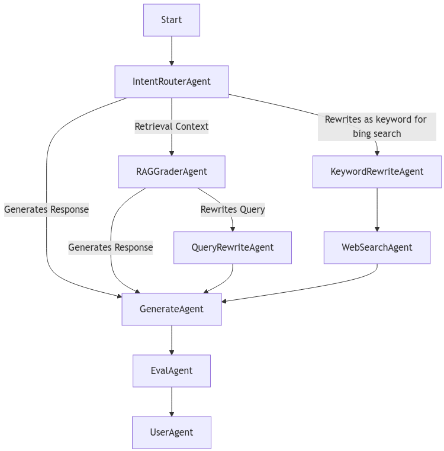

# Intermission Agentic Workflow Design Lab
Unlike traditional AI model development, agent-based architectures require a deep understanding of how different agents communicate, collaborate, and adapt based on dynamic inputs. To bridge this gap, all labs beyond Lab 0 incorporate dedicated brainstorming and whiteboarding sessions (30 minutes to 1 hour each) before hands-on implementation. These sessions provide participants with the opportunity to explore agent design intuitively, map out workflows, and refine their problem-solving approach before diving into coding. By engaging in structured discussions and collaborative ideation, participants will develop a clearer mental model of agentic AI systems, ensuring a smoother transition into hands-on implementation. 

## Agentic Design Template
Collaborative brainstorming and whiteboarding, organizing a group agentic architecture design session based on the specific requirements. 

